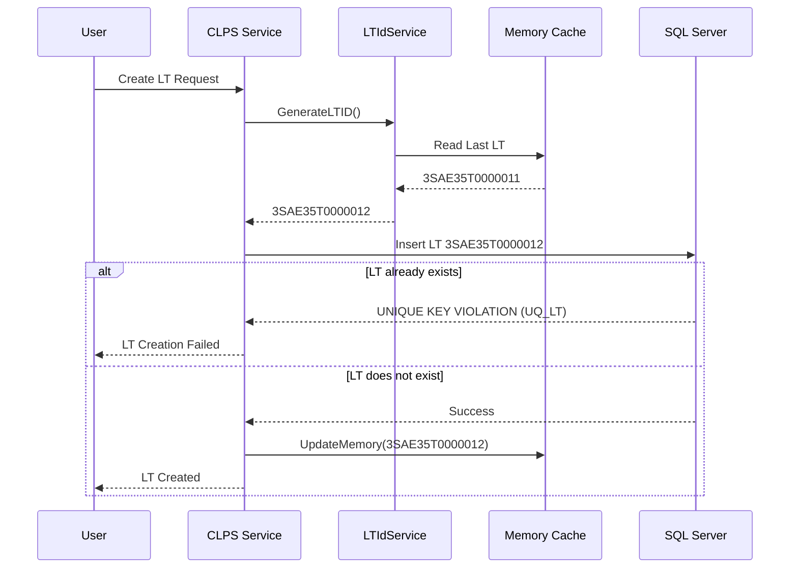

```mermaid
sequenceDiagram
participant User
participant CLPS as CLPS Service
participant LTGen as LTIdService
participant Cache as Memory Cache
participant DB as SQL Server
 
User->>CLPS: Create LT Request
 
CLPS->>LTGen: GenerateLTID()
 
LTGen->>Cache: Read Last LT
Cache-->>LTGen: 3SAE35T0000011
 
LTGen-->>CLPS: 3SAE35T0000012
 
CLPS->>DB: Insert LT 3SAE35T0000012
 
alt LT already exists
DB-->>CLPS: UNIQUE KEY VIOLATION (UQ_LT)
CLPS-->>User: LT Creation Failed
else LT does not exist
DB-->>CLPS: Success
CLPS->>Cache: UpdateMemory(3SAE35T0000012)
CLPS-->>User: LT Created
end
```
